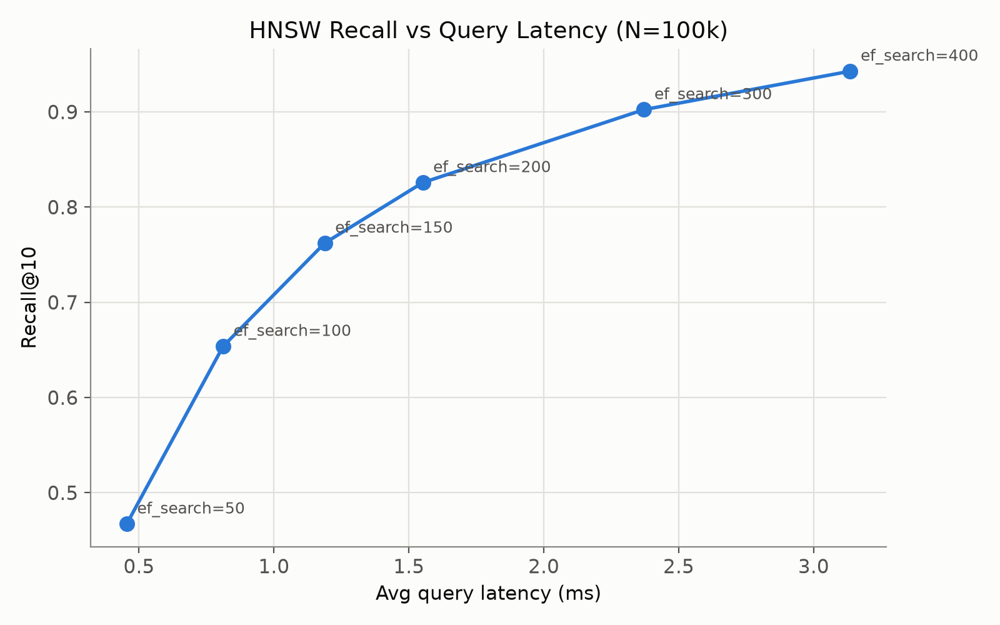
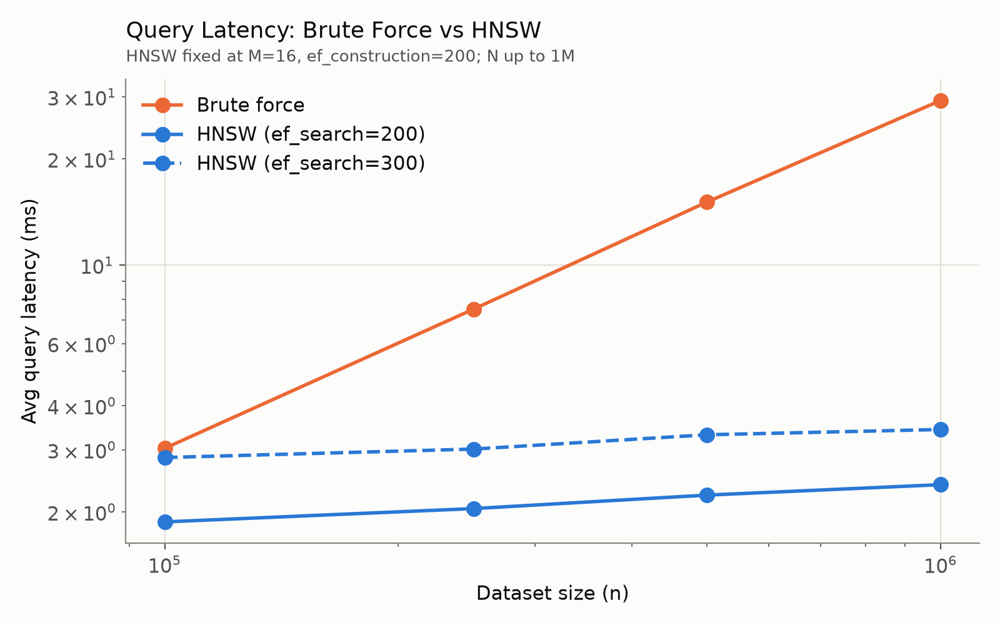
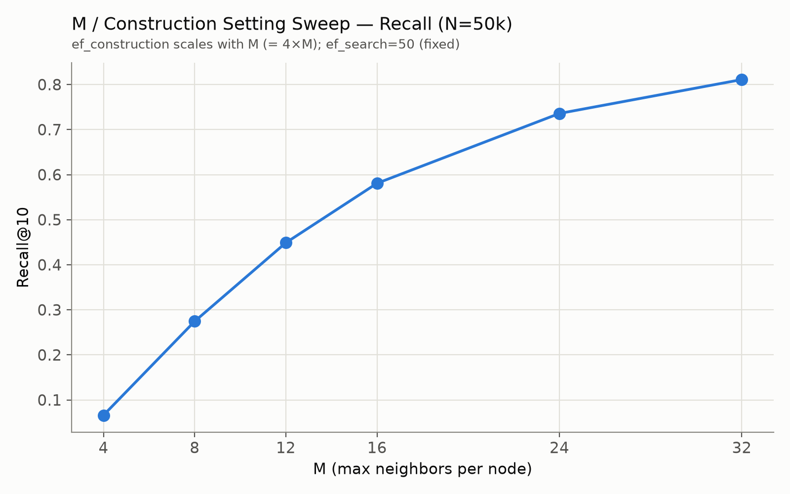
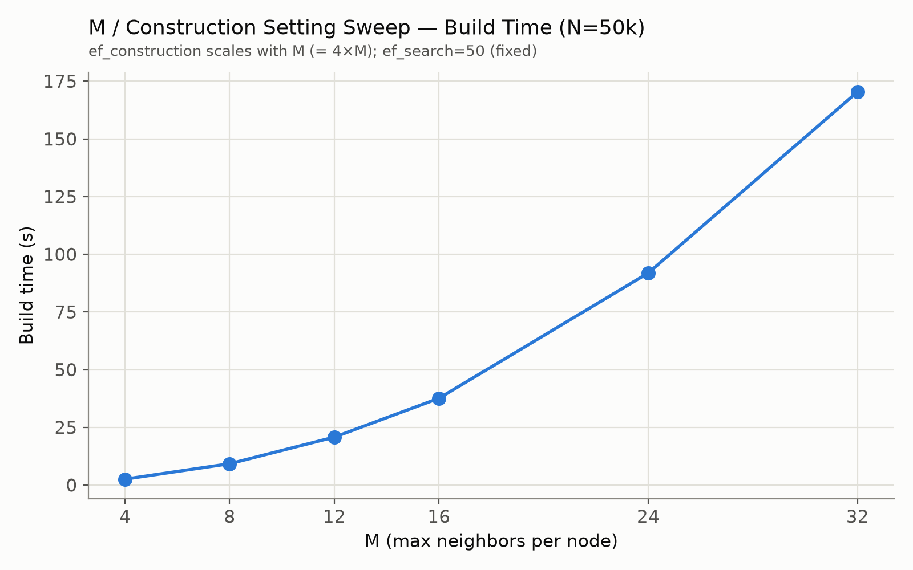

# HNSW Vector Search in C++

A from-scratch implementation of Hierarchical Navigable Small World (HNSW)
approximate nearest-neighbor search in C++17, with Python bindings via
pybind11.

The project includes:

- a brute-force exact k-nearest-neighbor baseline
- hierarchical HNSW graph construction and search
- configurable `M`, `ef_construction`, and `ef_search`
- recall, latency, throughput, and build-time benchmarks
- Python bindings for the C++ index
- a MovieLens recommendation demo using the HNSW index


## Architecture

```text
Python demo / user code
        ↓
      pybind11
        ↓
   C++ HNSWIndex
        ↓
hierarchical proximity graph
        ↓
approximate nearest-neighbor search
```


## How HNSW Works

HNSW organizes vectors into a hierarchy of proximity graphs.

Higher layers contain fewer nodes and allow the search to move quickly across
the dataset. Lower layers contain progressively more nodes, with layer 0
holding all indexed vectors.

A query starts from the current entry point at the highest layer and greedily
moves toward closer vectors. The search then descends through the hierarchy
until reaching layer 0, where a broader best-first search is used to produce
the final nearest-neighbor candidates.

```text
          sparse upper layer
               ●────●
                \  /
                 ●

                   ↓

           intermediate layer
          ●──●────●──●
              \  /

                   ↓

              layer 0
      ●──●──●──●──●──●──●──●
```

### Key parameters

- **`M`** — controls the maximum number of graph connections retained per
  node. Larger values can improve graph connectivity and recall, but increase
  construction cost and memory usage.

- **`ef_construction`** — controls the size of the candidate search during
  index construction. Larger values spend more work building the graph in
  exchange for potentially higher-quality connections.

- **`ef_search`** — controls how broadly the graph is explored during a
  query. Increasing it generally improves recall while increasing query
  latency.


### Implementation details

The implementation uses:

- squared Euclidean distance 
- a base-layer degree limit of `2M`
- diversified neighbor selection during graph construction and pruning
- separate candidate and result priority queues during layer search
- randomized level assignment
- exact brute-force search as a correctness baseline

## Benchmarks

Benchmarks compare the HNSW implementation against an exact brute-force
k-nearest-neighbor baseline.

Unless otherwise noted:

- vector dimension: `64`
- `k = 10`
- distance metric: squared Euclidean distance
- results averaged across multiple queries
- benchmark runs compiled in Release mode

### Recall vs query latency

At 100,000 vectors, increasing `ef_search` produces the expected
accuracy/latency tradeoff:

| ef_search | Avg query latency | QPS | Recall@10 |
|---:|---:|---:|---:|
| 50  | 0.450 ms | 2220 | 46.72% |
| 100 | 0.835 ms | 1198 | 65.38% |
| 150 | 1.198 ms | 834  | 76.22% |
| 200 | 1.604 ms | 624  | 82.58% |
| 300 | 2.401 ms | 416  | 90.24% |
| 400 | 3.197 ms | 313  | 94.28% |

Exact brute-force search averaged:

- **2.839 ms/query**
- **352 QPS**
- **100% recall**



Increasing `ef_search` improves recall by exploring a larger portion of the
graph, but increases query cost.

At `ef_search = 300`, the index reached approximately **90.2% recall@10**
while remaining slightly faster than exact brute-force search.

At lower search breadth, throughput increases significantly at the cost of
recall. For example, `ef_search = 50` achieved about **6.3× the throughput**
of brute-force search, with lower recall.

### Large-scale query latency and speedup

To evaluate scaling, the same HNSW configuration (`M=16`, `ef_construction=200`) was
benchmarked from 100k to 1M vectors. HNSW query latency grows much more slowly than
brute-force latency as the dataset increases.

| Dataset size | Brute force | HNSW `ef=200` | Speedup | Recall@10 | HNSW `ef=300` | Speedup | Recall@10 |
|---:|---:|---:|---:|---:|---:|---:|---:|
| 100k | 3.03 ms | 1.87 ms | 1.62x | 88.06% | 2.85 ms | 1.06x | 93.74% |
| 250k | 7.51 ms | 2.04 ms | 3.67x | 75.56% | 3.01 ms | 2.49x | 85.46% |
| 500k | 15.11 ms | 2.23 ms | 6.77x | 65.30% | 3.31 ms | 4.57x | 76.04% |
| 1M | 29.30 ms | 2.39 ms | **12.27x** | 54.78% | 3.42 ms | **8.56x** | 65.88% |

With a fixed search budget, HNSW's query latency remains relatively stable as the
index grows, while brute-force latency increases roughly with dataset size. The
tradeoff is that recall decreases at larger `N` unless `ef_search` is increased.



### Graph connectivity tradeoffs

I also benchmarked how graph connectivity affects recall and construction cost:





In this sweep, `ef_construction` was scaled together with `M`, so the experiment
shows the effect of increasing the overall construction setting rather than
isolating `M` alone.


## Python bindings & recommendation demo

The `hnsw_cpp` pybind11 module (`bindings.cpp`) exposes `HNSWIndex` to Python.
Build it into its own directory to avoid mixing Python and C++-only builds:

```
mkdir -p build-python && cd build-python
cmake .. && make hnsw_cpp
```

`python/recommend_demo.py` is a content-based movie recommender built on the
real [MovieLens ml-latest-small](https://grouplens.org/datasets/movielens/)
dataset (GroupLens / University of Minnesota; ~9,700 movies, ~100k ratings,
~3,700 user tags; free for research/education use, see
`data/ml-latest-small/README.txt` after downloading). Each movie is embedded
as a genre + user-tag + year + rating feature vector (`python/movielens.py`),
all of them are indexed with `HNSWIndex`, and recommendations are just
approximate nearest neighbors of a query movie.

```
bash scripts/download_movielens.sh                   # one-time, ~1 MB

python3 python/recommend_demo.py                     # a few example queries
python3 python/recommend_demo.py --title "Inception" -k 10
python3 python/recommend_demo.py --search "star wars" # browse matching titles
```
